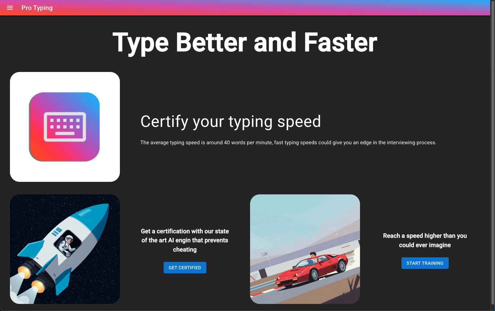
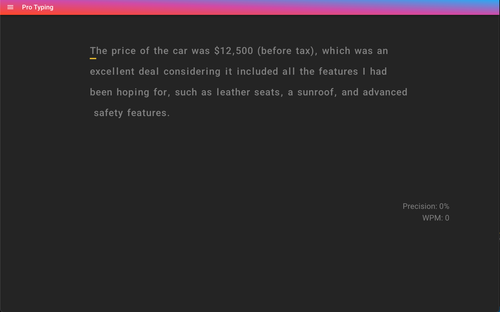

# ⌨️ ProTyping – Typing Speed Test Web Application

ProTyping is a web application designed to help users measure, analyze, and improve their typing speed and accuracy. The platform provides an intuitive typing test experience and delivers real-time performance metrics such as words per minute (WPM) and accuracy.

The application is built with a modern full-stack architecture, featuring a React frontend and a Golang backend. All services are hosted on Microsoft Azure and communicate through RESTful APIs.

## 🚀 Features

Typing speed test with real-time feedback

Calculation of WPM and typing accuracy

Clean and responsive user interface

Fast and scalable backend services

## 🧱 Technical Stack

Frontend: React

Backend: Golang

Architecture: REST APIs

Hosting & Deployment: Microsoft Azure

## 🛠 Architecture Overview

The React frontend handles user interactions and displays real-time typing metrics, while the Golang backend is responsible for processing test results, handling requests, and exposing RESTful endpoints. Azure is used to host and deploy the application, ensuring scalability and reliability.