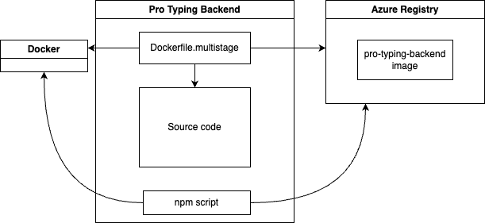

# Pro Typing Backend Deployment

The backend written in go is deployed using Docker and Azure services.

## Docker

For this web application, we are going to run the backend on docker while the frontend will be runned directly from a `node.js` server. For this step, you need to have docker installed on your computer. As you may know, docker is composed of two different elements : images and containers. `images` represents your application while `containers` are what runs your application. For the backend, we will create an `image` of the golang server. The `image` will then be pushed on an `azure registry service`. An `Azure Registry Service` is similar to `Docker Hub`, it is a repository where you can store your `images`.

In this repository, we have a `Dockerfile.multistage` file. This file contains all the necessary instructions to create an image of the golang project. It copies all golang files plus the asset and database folder.

Note that we are not using a `Dockerfile`. The reason why we are using a `Dockerfile.multistage` is that, as said in the  docker <a src="https://docs.docker.com/guides/golang/build-images/">documentation</a> for golang, the `Dockerfile` contains unnecessary dependencies that makes the image more than at least a Gig instead of hundreds of Mbs.

To deploy the application, we use Azure Registry to keep the latest version of the image. The command `npm run deploy` can be used to create a new image, to tag it properly and then to push it on the Azure Registry Server.

The registry container contains the latest image deployed of the server. To ensure that the latest version of the image is always deployed, we use a webhook that is connected from the Registry Container to the backend server.

For the backend server, we create a `Web Application` on Azure and uses directly the `Azure Registry Service` to select the desired image.

Once that the image is chosen, it is possible to have access to the API of the server using the following <a src="https://pro-typing-backend-gsevhcd3hseze8dn.canadacentral-01.azurewebsites.net/">link</a>.
